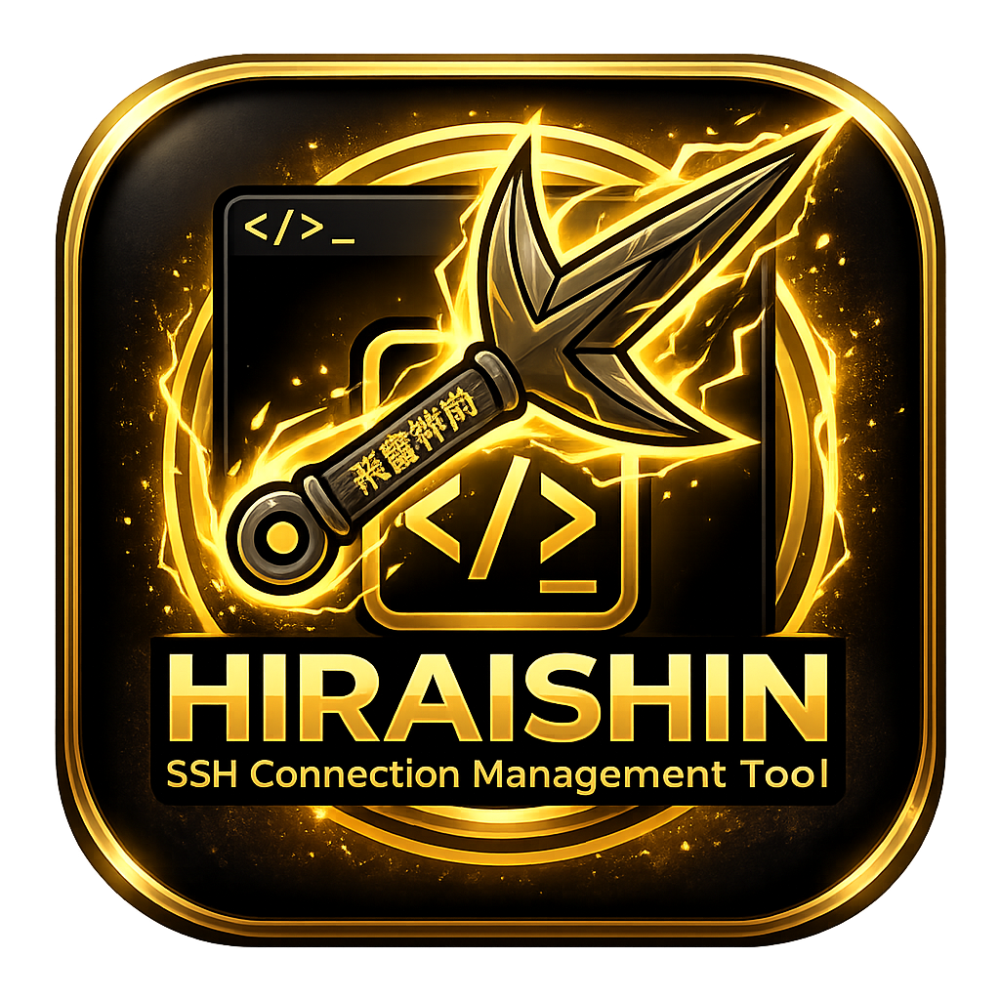

# Hiraishin

<p align="center">
  
</p>

Hiraishin adalah aplikasi desktop open source untuk mengelola koneksi SSH, terminal multi-session, credential terenkripsi, dan local port forwarding dalam satu workspace.

Project ini dibangun dengan Tauri, React, TypeScript, Rust, SQLite, dan xterm.js. Tujuannya adalah menyediakan SSH connection manager yang ringan, cepat, aman, dan bisa berjalan di macOS, Windows, dan Linux.

## Status Project

Hiraishin masih dalam tahap pengembangan aktif. Fitur utama sudah mulai tersedia, tetapi API internal, schema database, dan UX masih dapat berubah seiring kontribusi dari developer lain.

Project ini dibuka sebagai open source agar komunitas bisa ikut mengembangkan fitur, memperbaiki bug, meningkatkan keamanan, dan menyesuaikan aplikasi untuk kebutuhan workflow SSH yang lebih luas.

## Fitur

- Manajemen server SSH.
- Group untuk mengorganisasi koneksi.
- Terminal SSH multi-tab.
- Local port forwarding.
- Input private key langsung dari form koneksi.
- Penyimpanan credential dengan enkripsi.
- Database lokal menggunakan SQLite.
- Theme mode dark dan light.
- UI desktop dengan Tauri dan React.
- Build release untuk macOS, Windows, dan Linux.

## Tech Stack

- Tauri v2
- React 19
- TypeScript
- Rust
- SQLite
- xterm.js
- Tailwind CSS
- shadcn/ui style components
- Bun

## Prasyarat

Pastikan environment development sudah memiliki:

- Bun
- Rust stable
- Tauri system dependencies sesuai OS
- Node-compatible shell

Referensi setup Tauri:

- https://v2.tauri.app/start/prerequisites/

## Instalasi

```bash
bun install
```

## Menjalankan Development

```bash
bun run tauri dev
```

## Build Frontend

```bash
bun run build
```

## Build Desktop

```bash
bun run release:desktop
```

Build per platform:

```bash
bun run release:macos
bun run release:windows
bun run release:linux
```

Dokumentasi release tersedia di:

- [docs/release.md](./docs/release.md)

## Struktur Project

```text
.
├── src/                 # Frontend React
├── src-tauri/           # Backend Tauri/Rust
├── src-tauri/icons/     # App icons untuk desktop bundle
├── public/              # Asset publik frontend
├── docs/                # Dokumentasi project
└── .github/workflows/   # GitHub Actions
```

## Kontribusi

Kontribusi sangat terbuka untuk developer yang ingin ikut mengembangkan Hiraishin.

Area kontribusi yang dibutuhkan:

- Perbaikan bug koneksi SSH dan terminal.
- Pengembangan port forwarding.
- Peningkatan keamanan credential dan database.
- UI/UX desktop.
- Dokumentasi.
- Testing lint, unit test, dan integration test.
- Packaging dan release lintas platform.

Sebelum membuat pull request:

1. Buat branch dari branch utama.
2. Jalankan build frontend.
3. Jalankan check Rust.
4. Pastikan perubahan tetap kecil dan fokus.
5. Jelaskan perubahan dan alasan teknisnya di pull request.

Command validasi dasar:

```bash
bun run build
cd src-tauri && cargo check
```

## Keamanan

Hiraishin menyimpan data koneksi di database lokal aplikasi. Jangan commit database lokal, private key, password, token, atau credential pribadi ke repository.

Untuk laporan kerentanan keamanan, buat issue dengan detail minimal yang cukup untuk reproduksi. Jika project sudah memiliki kanal security khusus, gunakan kanal tersebut.

## Lisensi

Project ini dirilis sebagai open source menggunakan lisensi MIT.

Lihat [LICENSE](./LICENSE) untuk detail.
